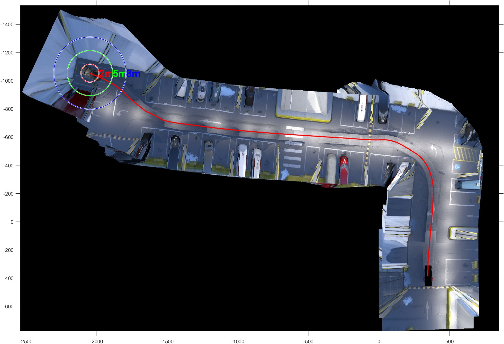

# Visual-Based Odometry Estimation

Concise MATLAB code for stitching panoramic images from four fisheye cameras in a vehicle's surround view system. For more information, please refer to [VisualBasedOdometryEstimation.md](./VisualBasedOdometryEstimation.md) or simply click  for out-of-the-box usage!

## Features

- Real-time application construction without the need to predefine the map size
- Pixel maps correspond directly to physical maps, facilitating easy query and localization
- Based on pure image algorithm only (no IMU, GPS, WheelEncoder, etc. to assist).
- Supports embedded C/C++ code generation
