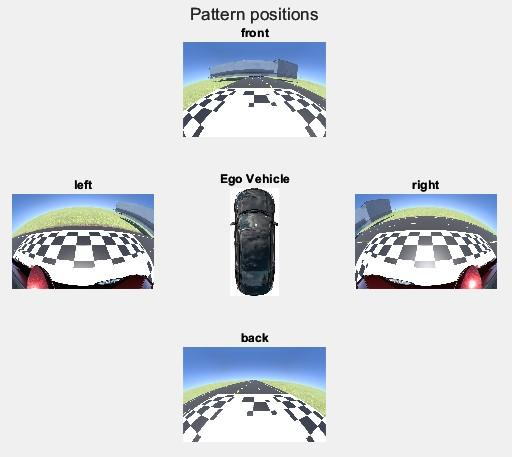
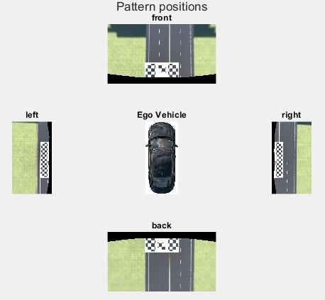
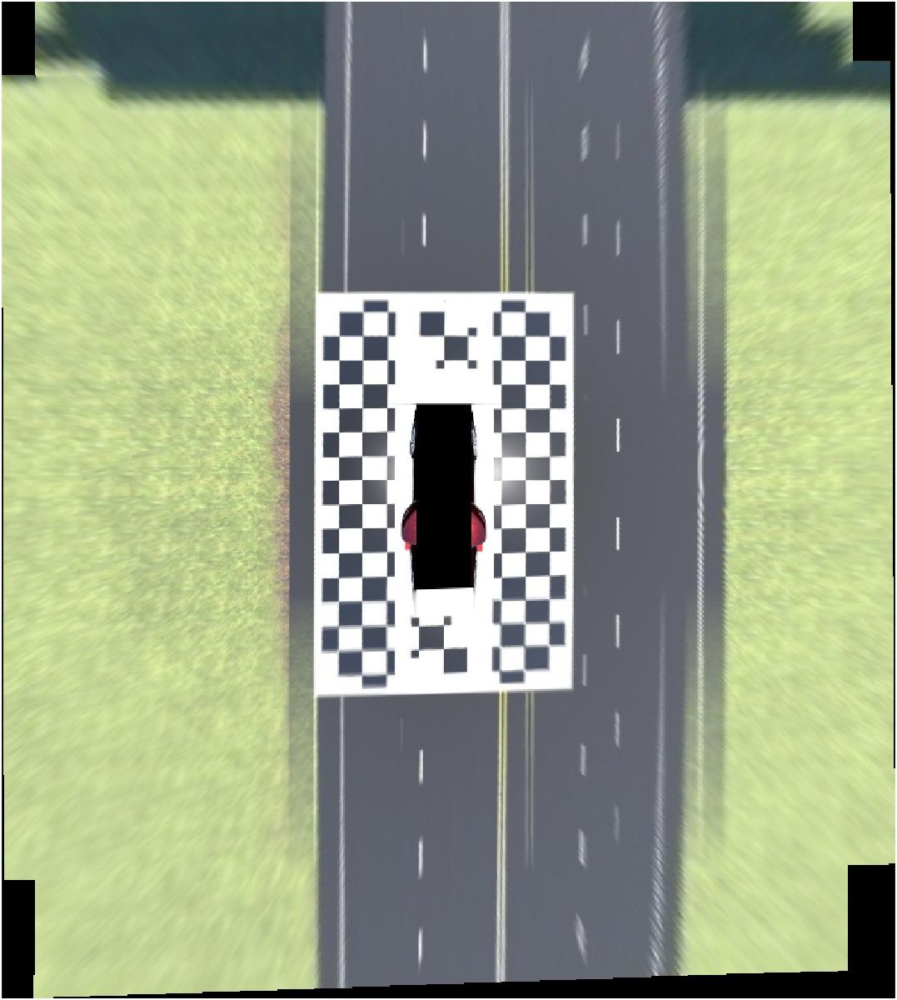
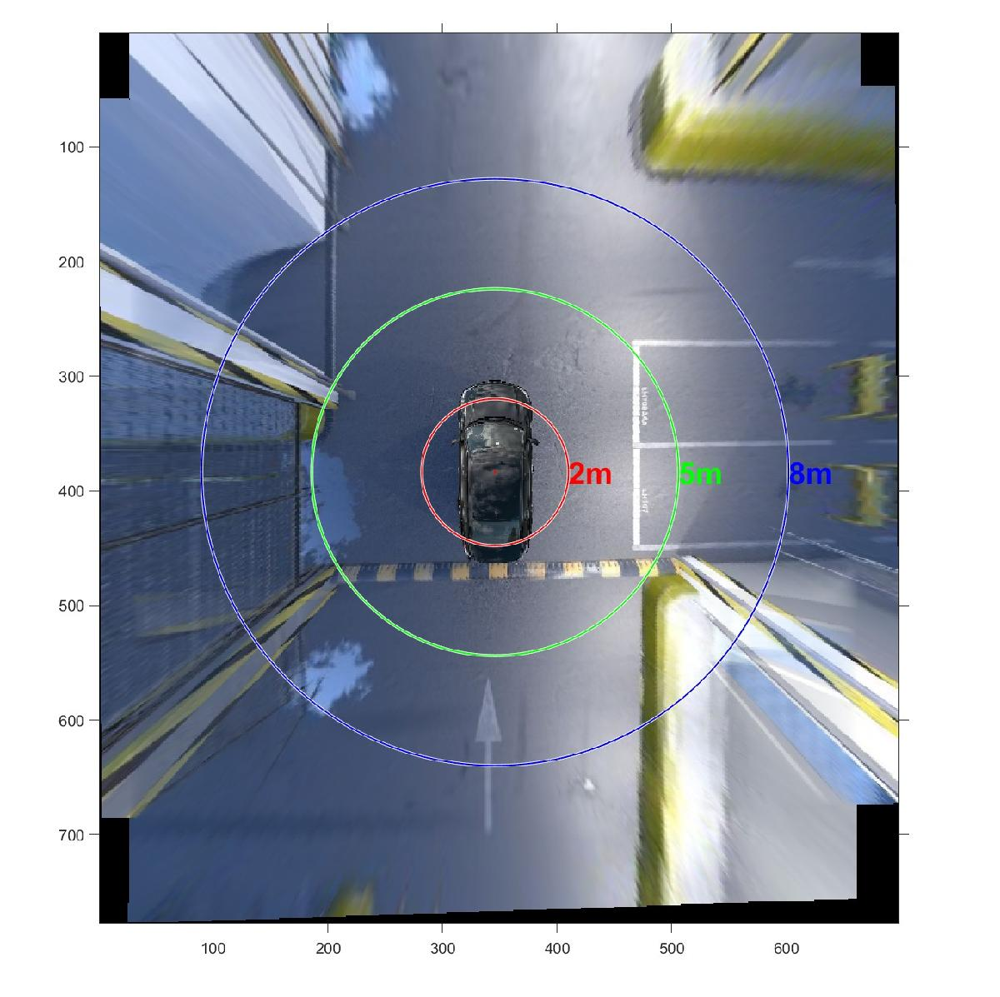
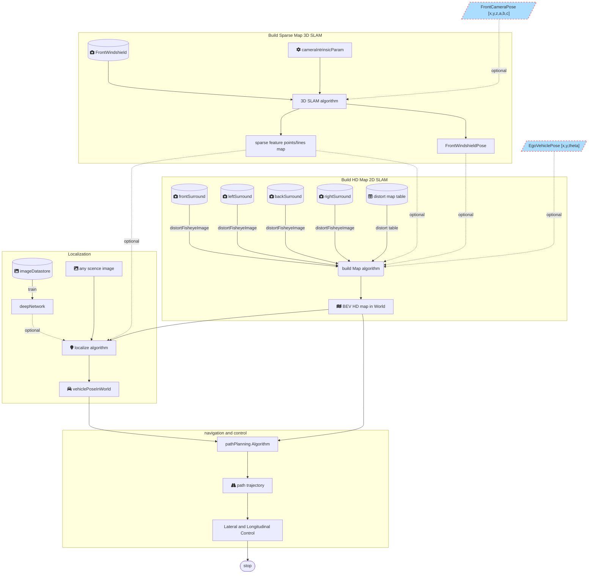
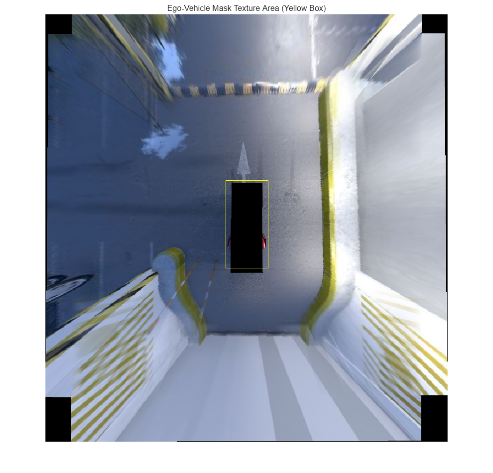
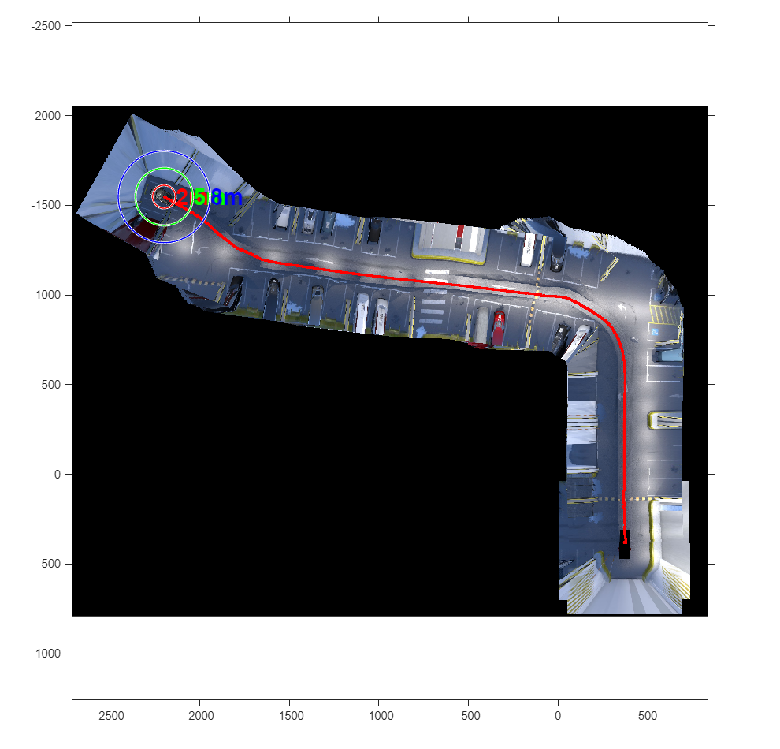

<a name="T_9A68E6A8"></a>

# <span style="color:rgb(213,80,0)">Visual\-Based Odometry Estimation</span>

Author: cuixngxing

Email: <cuixingxing150@gmail.com>

Date: 2022\-10


This example demonstrates a simple process for estimating odometry from a sequence of simulated images captured by a vehicle's four fisheye cameras. It progressively completes multi\-camera calibration, image stitching/fusion, Bird's Eye View generation, ORB feature detection/matching, geometric transformations, and ultimately constructs a pixel\-based map odometry in real\-time based on the images.

***To run this "mlx" file, it's best to use the corresponding "m" file to see dynamic display images!***

<a name="beginToc"></a>

## 目录

[Requirements](#H_D0472393)

[Fisheye Cameras Calibration](#H_9C9118D3)

[Architecture Overview](#H_8206BAB5)

[Implementation](#H_A33AE1C5)

&emsp;[Original Data](#H_100BE47A)

&emsp;[Create Iterable Datastore](#H_B25DDB8B)

&emsp;[Algorithm Initialisation](#H_D6262558)

&emsp;[Algorithm Core Module](#H_4DADA6F5)

[References](#H_C478B4EB)

<a name="endToc"></a>
<a name="H_D0472393"></a>

# Requirements

MathWorks Products ([<u>https://www.mathworks.com</u>](https://www.mathworks.com/))

- MATLAB R2022b or later
- Automated Driving Toolbox™
- Image Processing Toolbox™
- Computer Vision Toolbox™

Optional Products([opencv\-python · PyPI](https://pypi.org/project/opencv-python/))

- opencv\-python
<a name="H_9C9118D3"></a>

# Fisheye Cameras Calibration

Using the four pairs of fisheye surround view distortion images and the distortion parameters table from the Simulink simulation, the algorithm handles the calibration, projection, splicing, and fusion, along with the outputs in the real scene as outlined below. For more details, check out [<samp>fisheyeCameraCalibration.mlx</samp>](./fisheyeCameraCalibration.mlx) or [fisheyeCameraCalibration.pdf](./fisheyeCameraCalibration.pdf).

|      |      |
| :-: | :-- |
|  <br> Fig.1 Input Fisheye Image <br>  |  <br> Fig.2 Undistort Fisheye Images <br>   |
|  <br> Fig.3 Stiching Image <br>  |  <br> Fig.4 Real Projection Stiching <br>   |
|      |       |

<a name="H_8206BAB5"></a>

# Architecture Overview

The diagram illustrates the overall process architecture of the future project, mainly involving four parts: 3D Map, 2D Map, Localization, and Navigation And Control. Each part has corresponding inputs and outputs. Currently, this open project only focuses on the construction of the 2D Map, which can produce a perfect pixel map output using simple image algorithms.



<a name="H_A33AE1C5"></a>

# Implementation

The following code shows the simple implementation flow of the image algorithm.

<a name="H_100BE47A"></a>

## Original Data

Four panoramic fisheye images: imgFrontSurround, imgLeftSurround, imgRearSurround, and imgRightSurround, along with one undistorted front view image: imgFrontWindshield, are organized in the following directory tree structure. These images are generated from Simulink simulations, but they can also be obtained from images of real scenes.

```text
├── imgFrontSurround
│   ├── 1.jpg
│   ├── 2.jpg
│   ├── 3.jpg
│   ├── ...
│   ├── ...
│   └── 1186.jpg
├── imgFrontWindshield
│   ├── 1.jpg
│   ├── 2.jpg
│   ├── 3.jpg
│   ├── ...
│   ├── ...
│   └── 1186.jpg
├── imgLeftSurround
│   ├── 1.jpg
│   ├── 2.jpg
│   ├── 3.jpg
│   ├── ...
│   ├── ...
│   └── 1186.jpg
├── imgRearSurround
│   ├── 1.jpg
│   ├── 2.jpg
│   ├── 3.jpg
│   ├── ...
│   ├── ...
│   └── 1186.jpg
├── imgRightSurround
│   ├── 1.jpg
│   ├── 2.jpg
│   ├── 3.jpg
│   ├── ...
│   ├── ...
│   └── 1186.jpg
└── sensorData.csv
5 directories, 5931 files
```

```matlab
addpath("./buildMapFunctions")
addpath("./utils")
```

The imported "birdsEye360.mat" comes from the "[fisheyeCameraCalibration.mlx](./fisheyeCameraCalibration.mlx)" within this project. The "dataDir" contains a set of four panoramic fisheye images, which you can download from the GitHub repository by [clicking here](https://github.com/cuixing158/Visual-Based-Odometry-Estimation/releases/tag/v1.0.0). The directory structure is described above. After downloading and unzipping, place the files in a suitable location on your disk.

```matlab
% import pre-save data
load ./data/preSavedData/birdsEye360.mat 
dataDir = "your_dataDir/underParkingLotImages20220728"; % Attention,you should replace dataDir with your folder!
orderImages = ["imgFrontSurround","imgLeftSurround","imgRearSurround","imgRightSurround"];
numImgs = 1186;
```

<a name="H_B25DDB8B"></a>

## Create Iterable Datastore

For large image datasets, it is recommended to use the [<samp>imageDatastore</samp>](https://www.mathworks.com/help/matlab/ref/matlab.io.datastore.imagedatastore.html) function. To read from multiple underlying datasets simultaneously, use the [<samp>combine</samp>](https://www.mathworks.com/help/matlab/ref/matlab.io.datastore.combine.html) function to create a [<samp>CombinedDatastore</samp>](https://www.mathworks.com/help/matlab/ref/matlab.io.datastore.combineddatastore.html?s_tid=doc_ta) that supports iterable data.

```matlab
refOutputview = birdsEye{1}.OutputView;% [xmin,xmax,ymin,ymax] in vehicle coordinates
pixelExtentInWorldX = (refOutputview(4)-refOutputview(3))/birdsEye{1}.ImageSize(2);
pixelExtentInWorldY = (refOutputview(2)-refOutputview(1))/birdsEye{1}.ImageSize(1);

forders = fullfile(dataDir,orderImages);
imds = cell(1,length(orderImages));
% pat = "\"+digitsPattern+".png";
for i = 1:length(orderImages)
    imds{i} = imageDatastore(forders(i));
    imgNames = string(1:numImgs)'+".jpg";
    imds{i}.Files = forders(i)+filesep+imgNames;
end
imdsCombined = combine(imds{:});
```

<a name="H_D6262558"></a>

## Algorithm Initialisation

The ego\-vehicle continuously captures images from four panoramic fisheye cameras while driving through an underground parking lot. These fisheye images undergo a series of image processing algorithms, gradually accumulating and overlaying onto a large pixel map. To dynamically display this process, the algorithm requires some initializations, such as the ego\-vehicle's background image, visualization window, and range initialization.

```matlab
vehicleImg = imread('./images/vehicle.png',BackgroundColor=[0,0,0]);
vBW = sum(vehicleImg,3)~=0;
alphablend = vision.AlphaBlender('Operation','Binary Mask',...
    'MaskSource','Input port');

num = 0;
N = 50; % We'll start at frame 50 because the previous frames have a lot of noise image
isinitialized = 0;
xLimitGlobal = [1,1];
yLimitGlobal = [1,1];
bigImgSt = struct('bigImg',[],'ref',[]);
vehicleShowPts = [];% 大图上绘图轨迹点
figObj = figure(Name="consucrt map");
ax1 = axes(figObj);

```

<a name="H_4DADA6F5"></a>

## Algorithm Core Module

In each iteration, the algorithm receives four fisheye images. During the first frame, it performs additional necessary initializations, as the subsequent "mapping algorithm" depends on the valid mask areas. Furthermore, the physical coordinate reference is based on the camera center of the combined front view from the four fisheye panoramic images, designated as the origin of the [vehicle's coordinate system](https://www.mathworks.com/help/driving/ug/coordinate-systems.html#bvhvas6). The image coordinate reference is based on the pixel coordinate system of the first stitched image.

```matlab
while imdsCombined.hasdata()
    % step0:每次迭代拿到当前图像
    num = num+1;
    dataOut = read(imdsCombined);
    if num<N
        continue;
    end
    
    undistortImages = cell(1,4);
    BEV = cell(1,4);
    for i = 1:4
        undistortImages{i} = images.internal.interp2d(dataOut{i},mapX,mapY,...
            "linear",0, false);
        BEV{i} = transformImage(birdsEye{i},undistortImages{i});
    end

    tt = {tforms(1),tforms(2),tforms(3),tforms(4)};
    [outputImage, outputView] = helperStitchImages(BEV, tt);
    [h,w,~] = size(outputImage);
    if ~isinitialized
        % step1:人为定义一个任意形状的多边形范围，一般以车中心附近较好，图像清晰，
        % 畸变较小，用于累计构建大图。
        % 坐标基准为当前四副鱼眼环视图鸟瞰图拼接的前视图的相机中心为原点的车辆坐标系。
        vehiclePts = [-2,10;% 左下坐标点(x,y)，单位：米
            20,10;% 左上
            20,-10;%右上
            -2,-10];%右下
        localImagePts = vehicleToLocalImage(birdsEye{1},outputView,vehiclePts);
        v = localImagePts';% 预览范围
        vv = (v(:))';
        RGB = insertShape(outputImage,'polygon',vv);
        figure;imshow(RGB)
        title("Area to be Updated (Yellow Box)")
```

<center></center>

```matlab

        % 由于匹配图像中有车辆存在，故车辆范围内的特征点不考虑匹配
        vehicleRoiPts = [-4.5,1.2;% 左下坐标点(x,y)，单位：米
            0.5,1.2;% 左上
            0.5,-1.2;%右上
            -4.5,-1.2];%右下
        vehiclePolygon = vehicleToLocalImage(birdsEye{1},outputView,vehicleRoiPts);
        v = vehiclePolygon';% 预览范围
        vv = (v(:))';
        RGB = insertShape(outputImage,'polygon',vv);
        figure;imshow(RGB)
        title("Ego-Vehicle Mask Texture Area (Yellow Box)")
```

<center></center>

```matlab

        updateROI = [localImagePts;
            vehiclePolygon(3,1),localImagePts(1,2);
            vehiclePolygon(3,1),vehiclePolygon(3,2);
            vehiclePolygon(2,1),vehiclePolygon(2,2);
            vehiclePolygon(2,1),localImagePts(1,2)]; %这里为手写定义需要更新的ROI,注意顺序
        BW = poly2mask(updateROI(:,1),updateROI(:,2),h,w);%此区域为更新区域
        BWVehicle = poly2mask(vehiclePolygon(:,1),vehiclePolygon(:,2),h,w);
        
        vehicleXLims = [min(vehiclePolygon(:,1)),max(vehiclePolygon(:,1))];
        vehicleYLims = [min(vehiclePolygon(:,2)),max(vehiclePolygon(:,2))];
        vHight = round(vehicleYLims(2)-vehicleYLims(1));
        vWidth = round(vehicleXLims(2)-vehicleXLims(1));
        vBW = imresize(vBW,[vHight,vWidth]);
        rowStart = round(vehicleYLims(1));
        colStart = round(vehicleXLims(1));
        BWVehicle(rowStart:rowStart+vHight-1,colStart:colStart+vWidth-1)=vBW;
        
        % step2:世界坐标系姿态转换为全局图像坐标姿态/第一副图像坐标系
        resolutionXY = [pixelExtentInWorldX,pixelExtentInWorldY];
        
        % 以第一副图像坐标系为基准
        previousImage = outputImage;
        previousTform = rigidtform2d();
        
        [preFeatures, ~,prePoints] = helperDetectAndExtractFeatures(previousImage);
        imshow(outputImage,outputView,'Parent',ax1);
        isinitialized = 1;
    end

    % 使用orb特征匹配估计转换姿态
    [currFeatures, ~,currPoints] = helperDetectAndExtractFeatures(outputImage);
    relTform = estiTform(preFeatures,prePoints,currFeatures,currPoints,vehiclePolygon);
    currTform = rigidtform2d(relTform.A*previousTform.A);
    tform = invert(currTform);
    previousTform = currTform;

    
    % step3:针对当前4副鸟瞰图做变换到全局图像坐标系
    xLimitsIn = [0.5,w+0.5];
    yLimitsIn = [0.5,h+0.5];
    [xLimitsOut,yLimitsOut] = outputLimits(tform,xLimitsIn,yLimitsIn);
    
    % Width and height of panorama.
    xLimitInLocal = [min(xLimitsOut(1),xLimitsIn(1)),max(xLimitsIn(2),...
        xLimitsOut(2))];
    yLimitInLocal = [min(yLimitsOut(1),yLimitsIn(1)),max(yLimitsIn(2),...
        yLimitsOut(2))];
    
    xLimitGlobal = [min(xLimitGlobal(1),xLimitInLocal(1)),...
        max(xLimitGlobal(2),xLimitInLocal(2))];
    yLimitGlobal = [min(yLimitGlobal(1),yLimitInLocal(1)),...
        max(yLimitGlobal(2),yLimitInLocal(2))];
    
    outputImgWidth  = round(diff(xLimitGlobal));
    outputImgHeight = round(diff(yLimitGlobal));
    
    Ref = imref2d([outputImgHeight,outputImgWidth],xLimitGlobal,yLimitGlobal);
    [currViewImg,currRef] = imwarp(outputImage,tform,'OutputView',Ref);
    maskImg = imwarp(BW,tform,'OutputView',Ref);
    
    % step4: 融合到大图中去
    bigImgSt = blendImage(bigImgSt,currViewImg,currRef,maskImg);
    
    previousImage = outputImage;
    preFeatures = currFeatures;
    prePoints = currPoints;
    
    % step5: 绘图显示效果
    showBigImg = bigImgSt.bigImg;
    showRef = imref2d(bigImgSt.ref.ImageSize,bigImgSt.ref.XWorldLimits,bigImgSt.ref.YWorldLimits);
    
    % 画汽车外形bev图，即抠图贴图
    vehicleImgRA = imref2d(size(vehicleImg,[1,2]),vehicleXLims,vehicleYLims);
    dstVehicleImg = imwarp(vehicleImg,vehicleImgRA,tform,'OutputView',Ref);
    maskVehicle = imwarp(BWVehicle,tform,'OutputView',Ref);
    showBigImg = alphablend(showBigImg,dstVehicleImg,maskVehicle);
    imshow(showBigImg,showRef,'Parent',ax1);hold(ax1,"on");
    
    % 画车辆行驶轨迹
    vehicleCenterInLocal = mean(vehiclePolygon);
    temp = [vehicleCenterInLocal';1];
    vehicleCenterInBig = tform.A*temp;
    vehicleShowPts = [vehicleShowPts;[vehicleCenterInBig(1),vehicleCenterInBig(2)]];
    plot(ax1,vehicleShowPts(:,1),vehicleShowPts(:,2),'r.-','LineWidth',2);
    
    % 画半径
    showRadii = [2;5;8];% 自定义半径，看2m,5m半径区域
    colors = ["red","green","blue"];
    xOrigin = vehicleCenterInBig(1);
    yOrigin = vehicleCenterInBig(2);
    radii = showRadii./resolutionXY(1);
    centerPts = repmat([xOrigin,yOrigin],length(radii),1);
    for j = 1:length(radii)
        viscircles(ax1,centerPts(j,:),radii(j),...
            "Color",colors(j),"linewidth",1);
        text(ax1,centerPts(j,1)+radii(j),centerPts(j,2),...
            string(showRadii(j))+"m",...
            "FontSize",20,"FontWeight","bold","Color",colors(j));
    end
    hold(ax1,"off")
    axis(ax1,"equal");
    drawnow limitrate;
end
```

<center></center>

<center></center>

<a name="H_C478B4EB"></a>

# References

<a name="M_CDCB087F"></a>

1. [<u>Create 360° Bird's\-Eye\-View Image Around a Vehicle</u>](https://www.mathworks.com/help/driving/ug/create-360-birds-eye-view-image.html)
2. [Call Python from MATLAB](https://www.mathworks.com/help/matlab/call-python-libraries.html)
